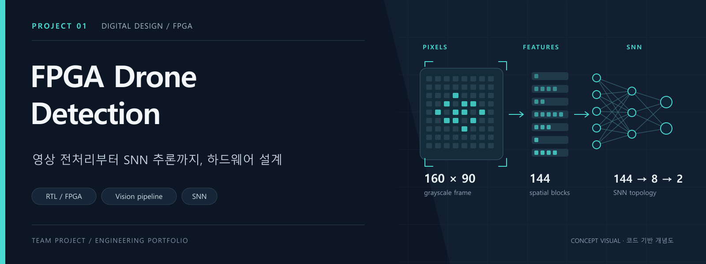
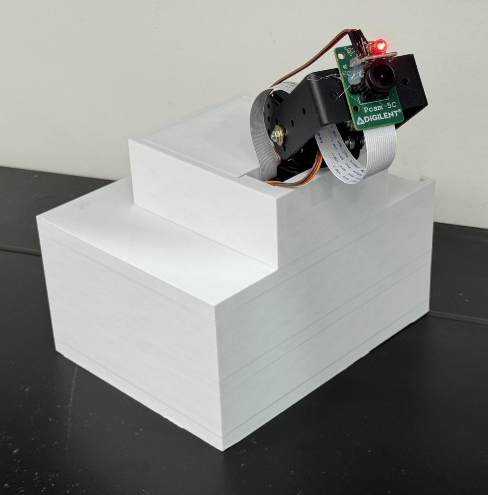

# FPGA 기반 드론 탐지·추적 종합설계

**SNN 조건부 감시 · INT8 CNN 탐지 · FPGA SoC 통합**

**표적이 드문 감시 환경에서 SNN이 움직임을 먼저 판단하고, 후보가 나타날 때 CNN을 실행하도록 설계한 FPGA 기반 탐지·추적 프로젝트입니다.**

카메라 입력, 영상 전처리, SNN·CNN, 프로세서 후처리와 팬틸트 제어를 Zybo Z7-20에 연결했습니다. 2026년 3~6월 수행 기록에는 외부 PC·GPU 없이 동작하는 시제품과 전류 비교 실험이 정리되어 있습니다. 이 포트폴리오는 그 개발 과정과 공개 소스를 함께 설명합니다.

[전체 팀 코드](https://github.com/jounget5411-lab/capstone_drone) · [설계 상세](docs/architecture.md) · [문제 해결 과정](docs/development.md) · [결과와 측정 조건](docs/results.md) · [핵심 코드 안내](docs/code-map.md)

| 프로젝트 | 핵심 기술 | 다루는 문제 |
|---|---|---|
| 종합설계 · 2026.03~06 | Zynq-7020 · Verilog · C/C++ · AXI · VDMA · SNN · INT8 CNN | 카메라·추론·제어를 단일 보드에 연결하고 희소 표적 환경의 평균 추론 비용 감소 |

*프로젝트 수행 기록에 수록한 시제품 사진입니다. PCam 5C와 팬틸트, 제작한 외장을 보여 줍니다. 추적 성능과 동작 지연은 사진만으로 판단할 수 없습니다.*

## 왜 SNN과 CNN을 함께 썼나

감시 영상에는 표적이 없는 시간이 길지만 CNN을 계속 실행하면 그 시간에도 연산 비용이 발생합니다. 움직임의 시간 패턴을 작은 SNN으로 먼저 판단하고, 위치를 정밀하게 구해야 할 때 CNN을 활성화하는 두 단계 구조를 선택했습니다. 일반 카메라의 프레임 차분으로 이벤트를 만들었으며, 실제 이벤트 카메라(DVS)를 사용한 구조는 아닙니다.

최종 수행 기록의 흐름은 **카메라 → SNN 감시 → CNN 위치 검출 → PS의 박스 복원·NMS → 팬틸트 제어 → 미검출 시 감시 복귀**입니다. 아래 도해는 공개 코드에서 확인한 영상 처리·SNN 경로를 자세히 보여 줍니다.

## 한눈에 보는 시스템

영상 전체를 그대로 신경망에 전달하는 대신, **이전 프레임과 달라진 위치를 공간별로 집계하고 여러 프레임에 걸쳐 분석**합니다. 프로세서에서는 카메라와 메모리 전송을 설정하고, FPGA에서는 영상 스트림과 추론 연산을 처리합니다.

| 단계 | 구현 내용 |
|---|---|
| 영상 입력 | OV5640 카메라와 MIPI 수신 경로, Bayer → RGB 및 감마 보정 |
| 움직임 추출 | 160 × 90 그레이스케일 영상과 이전 프레임의 픽셀 차이를 비교 |
| 특징 압축 | 10 × 10 픽셀 단위 집계 → 프레임당 144개 특징 → 3비트 양자화 |
| 시간 정보 처리 | 20프레임 순환 버퍼를 이용한 슬라이딩 윈도우 |
| 하드웨어 추론 | 144 → 8 → 2 구조의 SNN과 LIF 뉴런 상태 연산 |
| 결과 확인 | AXI GPIO 결과 읽기, UART 출력 및 원본·차분 영상 덤프 |

*표의 크기와 개수는 코드에 정의된 설정입니다. 처리 속도나 인식 정확도의 실측 결과를 뜻하지 않습니다.*

## 개발 중 해결한 문제

| 문제 | 원인을 좁힌 방법 | 적용한 해결 |
|---|---|---|
| 화면이 계속 검게 나옴 | UART 초기화, 합성 소스 포함 여부, AXI 프레임 신호를 따로 관찰 | VDMA 설정·누락된 RTL·첫 픽셀 동기 신호를 각각 수정 |
| 높은 학습 정확도와 실제 영상 성능이 다름 | 서로 겹치는 20프레임 샘플이 학습·평가 양쪽에 들어간 것을 확인 | 동영상 파일 단위로 분할하고 독립 영상 평가로 변경 |
| 정지 영상도 Fly로 판단 | 카메라를 분리한 all-zero RTL 시험으로 재현 | 임계값의 signed 비트폭을 확대하고 동률 판정을 명시 |
| CNN 통합 중 FPGA 자원 초과 | 모델 크기와 메모리의 BRAM/LUTRAM 배치를 분리해 분석 | 대용량 activation 메모리의 합성 형태와 초기화 경로를 수정·재확인 |

각 사례의 관찰값과 수정 범위는 [문제 해결 과정](docs/development.md)에 정리했습니다. 최종 패치가 공개 소스와 완전히 일치하는지 확인되지 않은 항목은 따로 표시했습니다.

## 수행 기록에 보고된 결과

| 항목 | 기록된 결과 | 해석 범위 |
|---|---|---|
| SNN 분류 | 정확도 98% | 평가셋 구성과 원시 결과는 추가 확인 대상 |
| CNN 검출 | AP@0.5 89% · 약 37 FPS | 전체 추적 루프 지연과 같은 지표는 아님 |
| FPGA 자원 | LUT 52.26% · BRAM 64.64% | 최종 통합 설계로 보고된 사용률 |
| 추론 추가 전류 | 출현율 1% 가정에서 약 42% 절감 | 카메라·HDMI 기준 부하를 뺀 증가분의 시나리오 계산 |

**42%는 보드 전체 소비전력 절감률이 아닙니다.** 기준 전류 595 mA를 제외한 추론 증가분을 비교한 값이며, 같은 계산의 보드 전체 전류 감소율은 약 1.4%입니다. 상태별 실측과 출현율에 따른 계산, 607/608 mA 표기 차이는 [결과와 측정 조건](docs/results.md)에 공개했습니다.

## 구현에서 집중한 부분

### 영상 처리와 제어 소프트웨어의 경계 설계

FPGA의 영상 경로는 AXI-Stream으로 연결하고, 프로세서의 C++ 애플리케이션은 카메라 초기화·VDMA 설정·가중치 전송을 담당하도록 구성했습니다. 영상 데이터와 제어 명령의 통로를 나눠 각 단계의 상태를 확인할 수 있게 했습니다.

[main.cc](https://github.com/jounget5411-lab/capstone_drone/blob/206404b4667d665620e731083eb8de6d972c248c/new_workspace/app_component/src/main.cc) · [Top.v](https://github.com/jounget5411-lab/capstone_drone/blob/206404b4667d665620e731083eb8de6d972c248c/hw_new_0426_cnnintegration/CORE_IP/src/Top.v)

### 움직임을 공간과 시간의 특징으로 표현

160 × 90 영상에서 움직임 픽셀을 16 × 9개 영역으로 집계합니다. 집계값을 3비트로 양자화하고, 20프레임의 특징을 순환 버퍼에 저장합니다. 프레임 한 장의 모양뿐 아니라 연속된 움직임을 추론 입력으로 구성한 것이 핵심입니다.

[feature_extractor.v](https://github.com/jounget5411-lab/capstone_drone/blob/206404b4667d665620e731083eb8de6d972c248c/hw_new_0426_cnnintegration/CORE_IP/src/feature_extractor.v) · [snn_top.v](https://github.com/jounget5411-lab/capstone_drone/blob/206404b4667d665620e731083eb8de6d972c248c/hw_new_0426_cnnintegration/CORE_IP/src/snn_top.v)

### 연산 단계를 나누고 중간 결과를 관찰

프레임 차분 출력에 레지스터 단계를 두고, SNN의 MAC 연산과 LIF 갱신도 여러 상태로 나눴습니다. 긴 조합 경로를 줄이려는 구조이며, 실제 타이밍 충족 여부는 합성·구현 보고서에서 별도로 검증해야 합니다.

디버깅 시에는 UART 명령으로 원본 그레이스케일과 차분 영상을 내보내고, 분류 결과와 두 출력 뉴런의 스파이크 수를 확인할 수 있습니다.

[frame_diff.v](https://github.com/jounget5411-lab/capstone_drone/blob/206404b4667d665620e731083eb8de6d972c248c/hw_new_0426_cnnintegration/hw_new_backup/hw_new/hw.srcs/sources_1/new/frame_diff.v) · [snn_top.v](https://github.com/jounget5411-lab/capstone_drone/blob/206404b4667d665620e731083eb8de6d972c248c/hw_new_0426_cnnintegration/CORE_IP/src/snn_top.v)

### CNN과 후처리를 연결하는 인터페이스

공개 블록 설계에는 그레이스케일 영상과 SNN 결과 플래그를 입력받는 `dronet_accel_axi` 경로가 있습니다. CNN 연산기, 프레임 버퍼, AXI 제어 인터페이스가 포함됩니다. 6월 수행 기록에서는 AXI-Lite로 가중치를 로드하고, 20 × 11 × 6 RAW 출력을 PS에서 박스로 복원한 뒤 NMS와 추적 제어로 연결한 것으로 정리되어 있습니다.

[pcam_base_720p.bd](https://github.com/jounget5411-lab/capstone_drone/blob/206404b4667d665620e731083eb8de6d972c248c/hw_new_0426_cnnintegration/hw_new_backup/hw_new/hw.srcs/sources_1/bd/pcam_base_720p/pcam_base_720p.bd) · [최종 기록과 공개 소스의 차이](docs/architecture.md)

## 코드를 읽는 순서

1. **전체 흐름:** [main.cc](https://github.com/jounget5411-lab/capstone_drone/blob/206404b4667d665620e731083eb8de6d972c248c/new_workspace/app_component/src/main.cc)에서 초기화·가중치 로드·결과 확인을 살펴봅니다.
2. **하드웨어 연결:** [Top.v](https://github.com/jounget5411-lab/capstone_drone/blob/206404b4667d665620e731083eb8de6d972c248c/hw_new_0426_cnnintegration/CORE_IP/src/Top.v)에서 특징 추출기와 SNN의 입출력을 확인합니다.
3. **핵심 연산:** [feature_extractor.v](https://github.com/jounget5411-lab/capstone_drone/blob/206404b4667d665620e731083eb8de6d972c248c/hw_new_0426_cnnintegration/CORE_IP/src/feature_extractor.v)와 [snn_top.v](https://github.com/jounget5411-lab/capstone_drone/blob/206404b4667d665620e731083eb8de6d972c248c/hw_new_0426_cnnintegration/CORE_IP/src/snn_top.v)에서 특징 버퍼와 추론 상태 머신을 확인합니다.
4. **보드 수준 연결:** [pcam_base_720p.bd](https://github.com/jounget5411-lab/capstone_drone/blob/206404b4667d665620e731083eb8de6d972c248c/hw_new_0426_cnnintegration/hw_new_backup/hw_new/hw.srcs/sources_1/bd/pcam_base_720p/pcam_base_720p.bd)에서 카메라·메모리·추론·HDMI 경로를 확인합니다.

## 문서와 코드 출처

이 저장소는 프로젝트 설명과 설계 도해를 정리한 개인 포트폴리오입니다. 전체 팀 코드는 [기존 저장소](https://github.com/jounget5411-lab/capstone_drone)에 보관되어 있습니다. 코드 설명은 `206404b` 커밋, 개발 과정·최종 결과 설명은 프로젝트 수행 기록과 개발 요약을 기준으로 작성했습니다.

구조도는 소스에 근거해 새로 그린 설명용 그림입니다. 이번 문서 정리 과정에서 보드 실험을 새로 수행하지는 않았습니다. 최종 기록과 공개 코드의 시점 차이, 실행 환경과 재현에 필요한 자료는 [실행 환경과 검증 범위](docs/reproduction.md)에 정리했습니다.

---

[국민대 자율주행 프로젝트](https://github.com/jounget5411-lab/kookmin-autonomous-driving-portfolio) · [HL FMA 2025 프로젝트](https://github.com/jounget5411-lab/hlfma-2025-portfolio)
