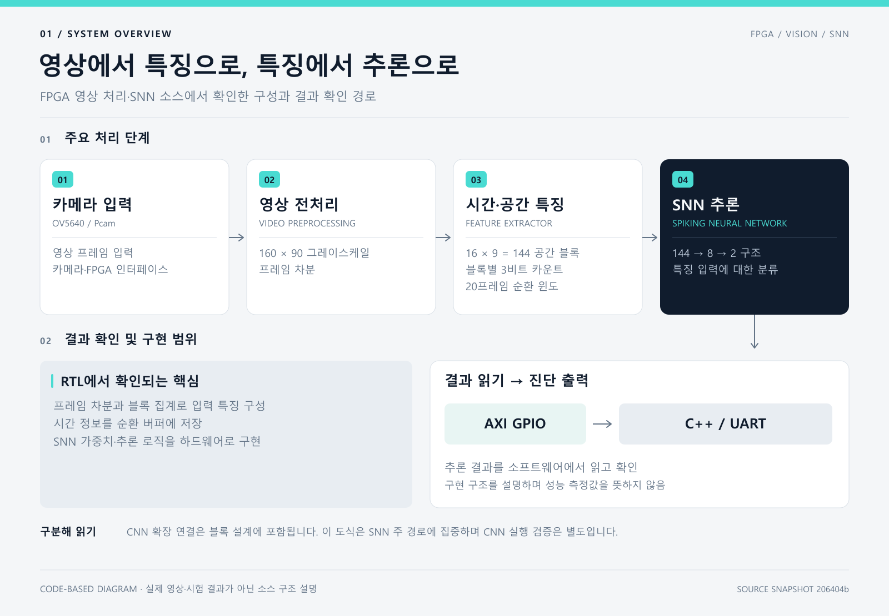

# 영상 처리와 추론 구조

[프로젝트 소개로 돌아가기](../README.md)

## 데이터 경로

`pcam_base_720p.bd`에서 확인되는 연결을 목적별로 정리했습니다.

- 카메라: MIPI D-PHY → CSI-2 → Bayer to RGB → Gamma correction
- 화면 출력: 영상 분기 → VDMA0 / DDR → Video out → HDMI
- 분류 입력: 영상 분기 → 축소·그레이스케일 → 현재 영상과 VDMA1에서 읽은 이전 영상의 차분
- 차분 출력: VDMA2 / DDR로 디버깅용 저장, 동시에 `Top`으로 전달
- SNN: 특징 추출 → 순환 특징 버퍼 → 추론 → 결과·스파이크 수 → AXI GPIO
- CNN 확장: 차분 전 그레이스케일 → `dronet_accel_axi`; SNN의 `result`도 플래그 입력에 연결

도해는 주요 SNN 경로에 집중합니다. HDMI 표시 경로와 일부 AXI 제어 연결은 위 목록과 원본 블록 설계를 함께 참고하세요.

## 영상에서 특징까지

`axis_frame_diff`는 현재·이전 픽셀의 절대 차이를 계산하고 임계값과 비교합니다. 기본 파라미터 `THRESHOLD`는 30입니다. 두 스트림의 프레임 시작·줄 끝 신호도 비교해 동기 불일치를 표시합니다.

`feature_extractor`는 이진 움직임 픽셀을 10 × 10 영역별로 집계합니다. 160 × 90 입력을 16 × 9 = 144개 특징으로 줄이며, 집계값은 0·1·2·4·8·16·32·64의 경계를 이용해 0~7로 양자화합니다. 연속 20프레임은 순환 주소로 저장하고, 윈도우가 채워진 뒤 SNN 추론을 시작합니다.

이 수치는 입력과 메모리 구성의 설명이며, 데이터셋 정확도를 나타내지 않습니다.

## SNN 연산 구조

| 구성 | 소스에 정의된 형태 |
|---|---|
| 첫 번째 층 | 입력 특징 144개, 뉴런 8개, 8비트 부호 있는 가중치 |
| 두 번째 층 | 입력 스파이크 8개, 출력 뉴런 2개 |
| 시간 단계 | 20 |
| 누산·뉴런 상태 | 32비트 부호 있는 값 |
| LIF 감쇠 | 이전 상태에 7/8을 곱한 뒤 입력 누산값을 더함 |
| 발화 | 임계값 이상일 때 스파이크를 내고 상태를 0으로 재설정 |
| 결과 | 두 출력 뉴런의 누적 스파이크 수를 비교 |

분류 결과의 소프트웨어 표기는 `FLY / NON-FLY`입니다. 결과 값의 의미와 CNN 플래그의 유효 극성은 실기 테스트에서 함께 확인해야 합니다.

## PS와 PL의 연결

PS는 Cortex-A9에서 동작하는 standalone C++ 애플리케이션입니다. 카메라와 VDMA를 초기화하고 GPIO에 가중치·임계값을 씁니다. PL은 영상 스트림과 추론을 처리하고, 완료 여부·분류 결과·스파이크 수를 GPIO로 전달합니다.

코드 주석은 영상·추론 클럭을 150 MHz, 제어 클럭을 100 MHz로 구분합니다. 이는 설계 설정의 설명이며 실측 처리율이나 타이밍 여유를 보증하는 값은 아닙니다.

## CNN 확장 경로의 범위

블록 설계에는 `dronet_accel_axi_0` 인스턴스와 입력 영상·AXI 제어·SNN 결과 플래그 연결이 있습니다. 관련 RTL에는 ping-pong 프레임 버퍼, convolution 연산기, 출력 버퍼와 제어 상태 머신이 있습니다.

`dronet_cnn_core`의 가중치·바이어스 파일 파라미터 기본값은 빈 문자열입니다. 현재 확인한 C++ 애플리케이션은 SNN 가중치 로드와 결과 읽기 중심이므로, CNN 가중치 준비·시작 명령·출력 해석까지 실제로 수행한 자료는 별도로 확인해야 합니다. 따라서 CNN 블록 연결을 곧바로 검출·추적 전체 동작 완료로 해석하지 않습니다.

## 근거 파일

[Vivado 블록 설계](https://github.com/jounget5411-lab/capstone_drone/blob/206404b4667d665620e731083eb8de6d972c248c/hw_new_0426_cnnintegration/hw_new_backup/hw_new/hw.srcs/sources_1/bd/pcam_base_720p/pcam_base_720p.bd), [Top.v](https://github.com/jounget5411-lab/capstone_drone/blob/206404b4667d665620e731083eb8de6d972c248c/hw_new_0426_cnnintegration/CORE_IP/src/Top.v), [feature_extractor.v](https://github.com/jounget5411-lab/capstone_drone/blob/206404b4667d665620e731083eb8de6d972c248c/hw_new_0426_cnnintegration/CORE_IP/src/feature_extractor.v), [snn_top.v](https://github.com/jounget5411-lab/capstone_drone/blob/206404b4667d665620e731083eb8de6d972c248c/hw_new_0426_cnnintegration/CORE_IP/src/snn_top.v), [frame_diff.v](https://github.com/jounget5411-lab/capstone_drone/blob/206404b4667d665620e731083eb8de6d972c248c/hw_new_0426_cnnintegration/hw_new_backup/hw_new/hw.srcs/sources_1/new/frame_diff.v), [dronet_cnn_core.v](https://github.com/jounget5411-lab/capstone_drone/blob/206404b4667d665620e731083eb8de6d972c248c/hw_new_0426_cnnintegration/hw_new_backup/hw_new/hw.srcs/sources_1/imports/rtl_0426/dronet_cnn_core.v)

