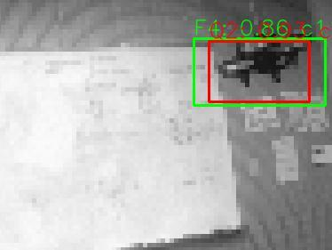
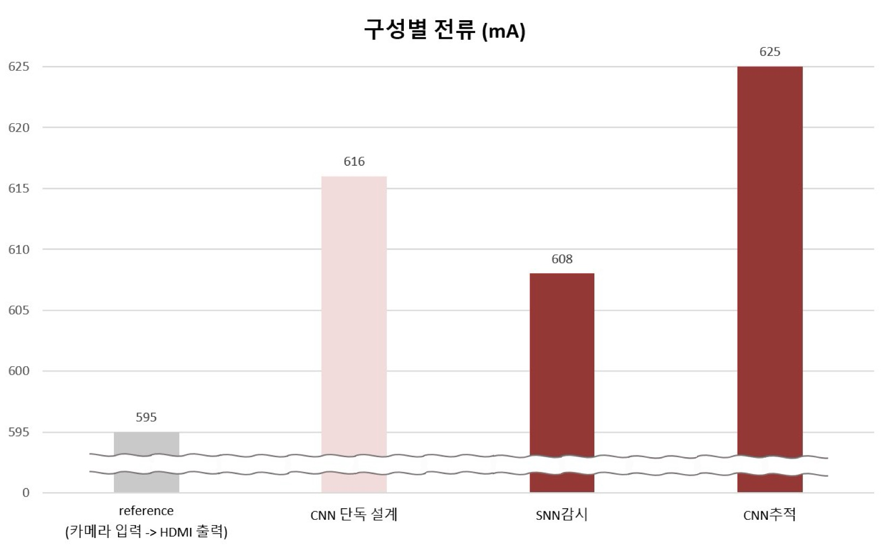

# 결과와 측정 조건

[프로젝트 소개로 돌아가기](../README.md) · [개발 환경과 실행 안내](reproduction.md)

최종보고서·포스터에 정리한 모델 성능, FPGA 자원 사용률과 상태별 전류 비교 결과입니다.

## 모델 성능과 FPGA 자원

| 지표 | 결과 |
|---|---|
| SNN 분류 정확도 | 98% |
| SNN 연산 지연 | 약 23,560사이클 · 약 236 µs(100 MHz 환산) |
| CNN 검출 성능 | AP@0.5 89% |
| CNN 처리율 | 약 37 FPS |
| CNN 연산량 | 약 42M MAC/frame |
| LUT | 27,802개 / 52.26% |
| FF | 22,986개 / 21.6% |
| BRAM | 90.5개 / 64.64% |
| DSP48E1 | 7개 / 3.18% |

SNN은 20프레임의 특징을 모아 시간 패턴을 분류합니다. 위 연산 지연은 특징 수집 이후 SNN 추론 구간의 값입니다.

## 검출 화면과 시제품

<p align="center"></p>

*동일 프레임의 검출 박스 비교: 소프트웨어는 녹색, INT8 하드웨어는 빨간색.*

단일 보드에 카메라·추론·팬틸트를 통합하고 약 55초의 시연 영상을 제작했습니다. 완성한 시제품은 [프로젝트 소개](../README.md)에서 볼 수 있습니다.

## 상태별 입력 전류

5 V 전원 경로에서 멀티미터로 전류를 비교했습니다. 카메라 입력과 HDMI 출력을 기준 설계로 두고, 추론 기능을 추가했을 때의 전류 증가분을 측정했습니다.

| 상태 | 입력 전류 | 기준 595 mA 대비 |
|---|---|---|
| 카메라 → HDMI 기준 설계 | 595 mA | 0 mA |
| CNN 상시 실행 | 616 mA | +21 mA |
| SNN 감시 | 607 mA(후속 측정) | +12 mA |
| CNN 추적 활성 | 625 mA | +30 mA |

<p></p>

*상태별 입력 전류 비교. 포스터의 SNN 감시 측정값은 608 mA이며, 후속 측정값은 607 mA입니다. 측정 중 변동은 약 ±2 mA였습니다.*

## 조건부 추론의 평균 전류

상태별 측정값을 바탕으로 표적 출현율에 따른 평균 추론 전류를 계산했습니다. 출현율 `d`를 CNN 추적 활성 비율로 두고, 감시 상태 +12 mA와 추적 상태 +30 mA를 가중 평균합니다.

```text
평균 추론 추가 전류 = (1 − d) × 12 + d × 30 = 12 + 18d [mA]
CNN 상시 실행 대비 절감률 = (21 − 평균 추론 추가 전류) / 21
```

| 출현율 시나리오 | 평균 추론 추가 전류 | 추론 추가 전류 절감률 | 기준 부하를 포함한 평균 전류 |
|---|---|---|---|
| 50% | 21.0 mA | 0% | 616.0 mA |
| 10% | 13.8 mA | 약 34% | 608.8 mA |
| 1% | 12.18 mA | 약 42% | 607.18 mA |

**출현율 1% 시나리오에서 추론 추가 전류를 약 42% 줄이는 구조입니다.** 비교 기준은 카메라·HDMI의 공통 부하 595 mA를 제외한 추론 증가분입니다. 같은 시나리오의 보드 전체 평균 전류는 616 mA에서 607.18 mA로 약 1.4% 감소합니다.

표적이 드물수록 SNN 감시 상태에 머무는 시간이 길어지고, CNN 상시 실행 방식과의 평균 추론 비용 차이가 커집니다.
